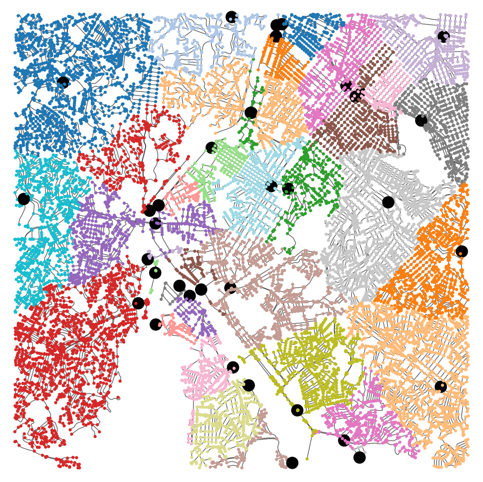
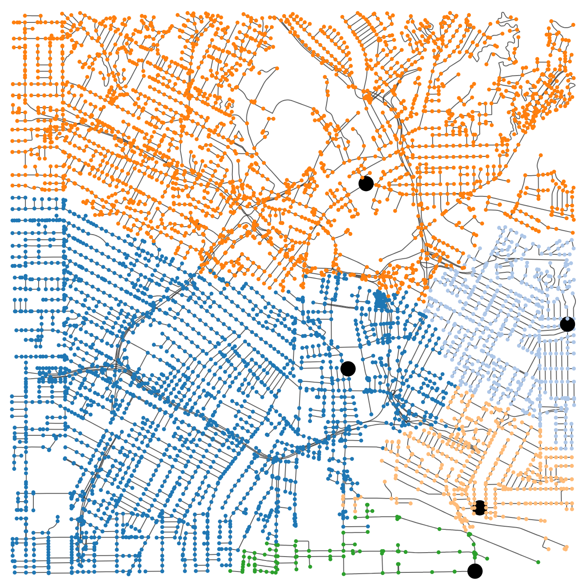
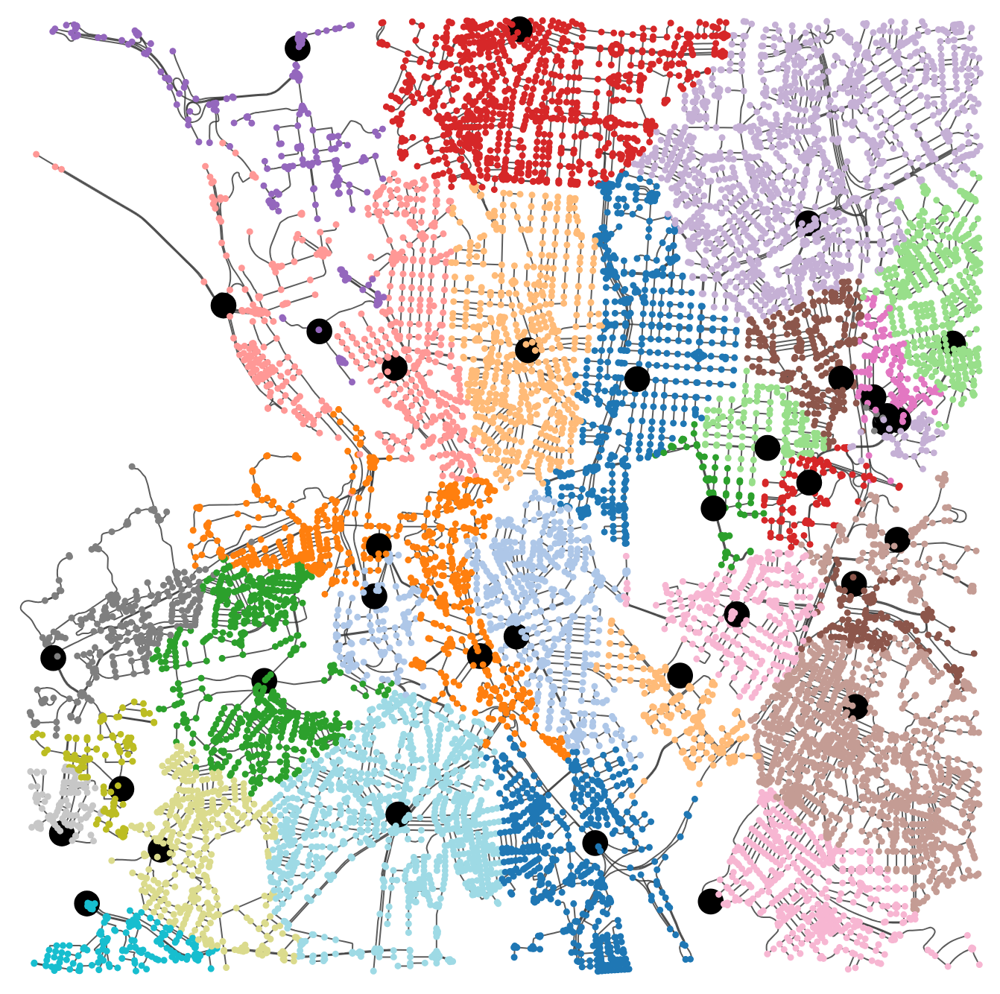
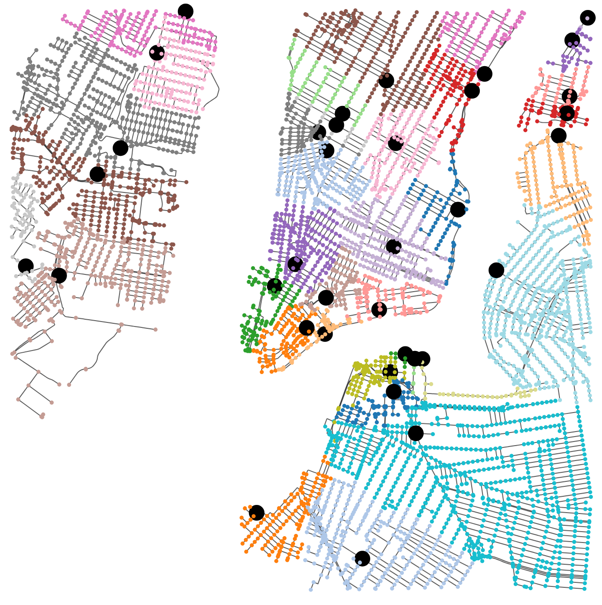
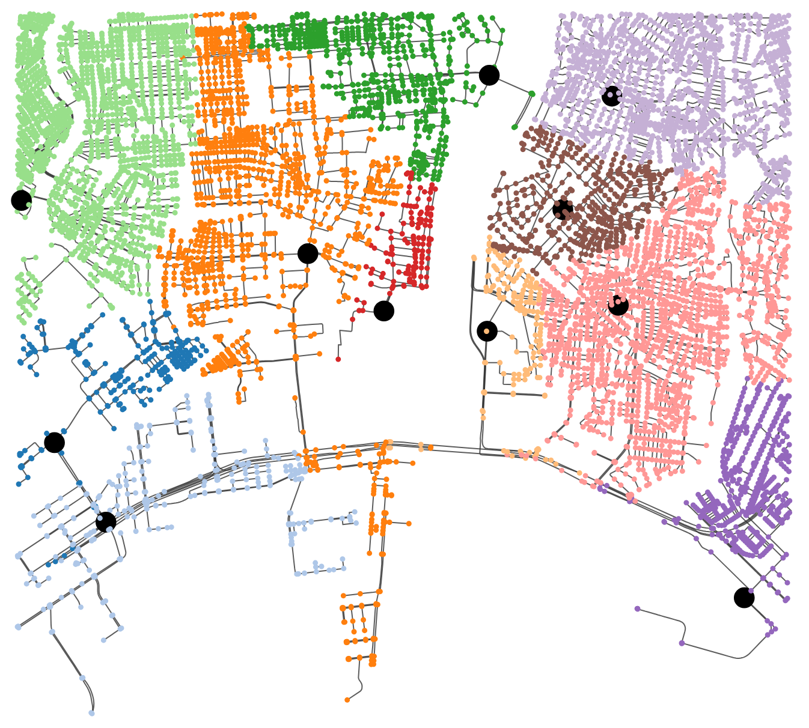

---

```markdown
# bayesgrid

[](https://opensource.org/licenses/MIT)
[](https://www.python.org/downloads/)

**`bayesgrid`** is an open-source Python toolbox for generating synthetic, probabilistic power transmission and distribution systems for any geographical location worldwide. 

By integrating real-world street data from **OpenStreetMap (OSM)** with **Bayesian Hierarchical Models (BHM)**, `bayesgrid` overcomes the scarcity of public utility data. Unlike deterministic tools that output a single static grid, `bayesgrid` generates statistically rigorous *ensembles* of physically feasible networks, allowing researchers to accurately quantify uncertainty in modern power system studies.

---

## Key Features

* **Global Applicability**: Generate geographically accurate synthetic grids for any city, neighborhood, or bounding box worldwide using OpenStreetMap.
* **Probabilistic & Stochastic**: Treats grid parameters as random variables, generating multiple distinct network realizations for robust Monte Carlo simulations and uncertainty quantification.
* **3-Phase Unbalanced Modeling**: Ensures strict topological phase-consistency (downstream phases are subsets of upstream phases) while modeling detailed unbalanced active and reactive power demands.
* **Built-in Reliability Indices**: Uniquely incorporates critical customer-centric reliability metrics—**CAIFI** (interruption frequency) and **CAIDI** (interruption duration)—directly into the synthetic grid.
* **Ready-to-Simulate Exports**: Seamlessly export generated grid ensembles into standard formats compatible with **OpenDSS** and **Pandapower**.
* **Custom Data Training**: Use the pre-trained models (based on a massive Brazilian utility dataset) right out of the box, or train the Bayesian models on your own custom datasets.

---

## How It Works

The framework consists of data standardization, topology estimation via OSM, Bayesian learning, and transfer learning to project probabilistic parameters onto the generated geographic topology.


### The Core Modules
The tool abstracts complex Bayesian statistics into an accessible API with 5 main modules:
1. **Core Bayesian Models**: `BayesianPowerModel`, `BayesianImpedanceModel`, `BayesianFrequencyModel`, and `BayesianDurationModel`.
2. **Learning**: Train the models with user-defined datasets using the NUTS sampler.
3. **Topology Generation**: Fetch street graphs via queries like City Name, Bounding Box, or Coordinates.
4. **Transfer Learning**: Sample physically consistent electrical and reliability parameters conditioned on the new topology.
5. **Export**: Save to `.dss` (OpenDSS) or `.json` (Pandapower).


---

## Quick Start

Creating a full synthetic grid ensemble from scratch requires just a few lines of code. The following example generates 1,000 distinct realizations for a 1.5 km radius around São Paulo, Brazil.

```python
import bayesgrid as bg

# Step 1: Initialize Bayesian Models 
# (Automatically loads pre-trained parameters)
bpm = bg.BayesianPowerModel()
bim = bg.BayesianImpedanceModel()
bfm = bg.BayesianFrequencyModel()
bdm = bg.BayesianDurationModel()

# Step 2: Generate Topology from OpenStreetMap 
graph, hop_zone_list, source_bus = bg.create_osm_pandapower_network(
    query_type="address",
    query_address="Sao Paulo, Brazil",
    dist=1500
)

# Step 3: Synthesis via Transfer Learning 
# (Generates 1000 probabilistic samples for the target region)
bpm.generate_consistent_data(graph, hop_zone_list, source_bus, n=1000)
bim.generate_consistent_data(graph, hop_zone_list, source_bus, n=1000)
bfm.generate_consistent_data(graph, hop_zone_list, source_bus, n=1000)
bdm.generate_consistent_data(graph, hop_zone_list, source_bus, n=1000)

# Step 4: Export to Simulation Formats 
# (Saves files ready for unbalanced power flow analysis)
bg.save_synthetic_network(
    base_net=graph, 
    format="opendss", 
    output_dir="./synthetic_grids"
)

```

---

## Documentation & Tutorials

A step-by-step tutorial on how to use the package can be found in the `notebook_tutorials` directory.

These notebooks cover:

* Basic topology generation.
* How to use pre-trained models vs. training on your own data.
* Exporting and running power flow simulations in OpenDSS/Pandapower.
* Visualizing uncertainty and reliability distributions.

---

## Gallery: Generated Ensembles

Because `bayesgrid` is probabilistic, generating multiple instances yields different, yet physically viable, phase allocations and power demands for the exact same geographic topology.

*Three distinct phase-allocation samples generated for the exact same underlying street topology. The framework guarantees that downstream branches always respect the phase constraints of their parent nodes.*

`bayesgrid` scales globally. You can generate detailed topologies for virtually any location on earth:

<p align="center">





</p>
*Topologies generated for São Paulo, Los Angeles, Madrid, New York, and Tokyo.*

---

## Citation

If you use `bayesgrid` in your research, please cite our paper:

```bibtex
@article{caetano2025bayesgrid,
  title={bayesgrid: An Open-Source Python Tool for Generating Synthetic Transmission-Distribution Grids Using Bayesian Hierarchical Models},
  author={Caetano, Henrique O. and Gupta, Rahul K. and Maciel, Carlos D.},
  journal={IEEE Transactions on ...}, % Update with actual journal once published
  year={2025}
}

```

*For more details on the methodology, validation, and underlying statistical framework, please refer to our related works cited in the main paper.*

---

## License

The code in this repository is licensed under the **MIT License** (MIT).
See `LICENSE.txt <LICENSE.txt>`_ for rights and obligations.

```

```
